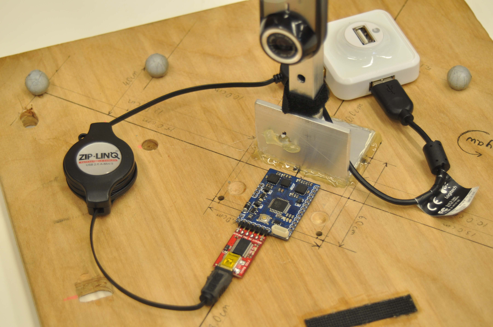
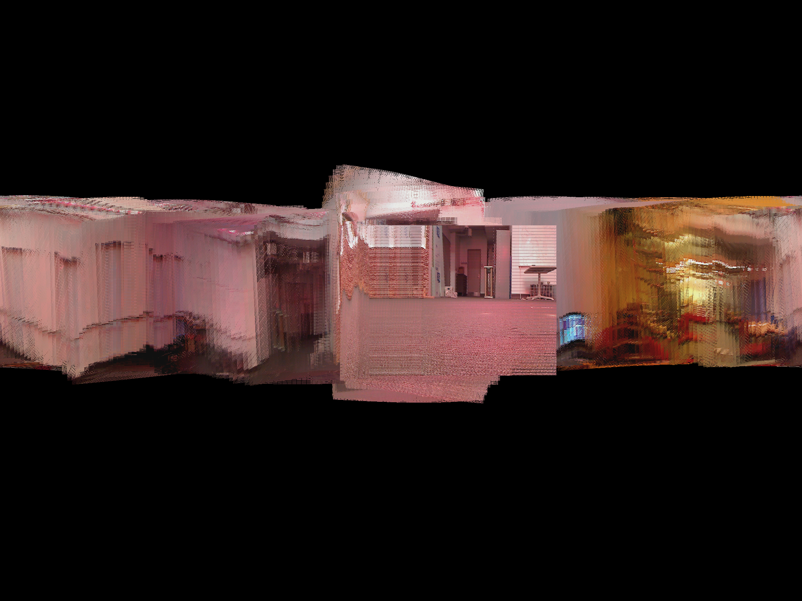

# 3D Orientation Tracking and Panorama Reconstruction

**Course:** ECE 276A: Sensing & Estimation in Robotics  
**Institution:** University of California San Diego  
**Author:** Nathan Van Utrecht 

---

## ⚠️ Academic Integrity Notice
**The source code for this implementation is hidden in this public repository.** This is to comply with the strict academic integrity and collaboration policies of the course, which strictly forbid copying code. If you are a recruiter or researcher and would like to discuss the implementation details, please contact me directly.

---

## Project Setup
This project focuses on estimating the 3D orientation of a rotating body over time using raw measurements from an Inertial Measurement Unit (IMU) and an RGB camera. The camera captures 320 x 240 RGB images, and its optical axis is aligned with the IMU's z-axis. Physically, the camera is positioned approximately 10 cm above the IMU. 

## Mathematical Formulation
The core tracking problem is formulated as a constrained optimization task over the space of unit quaternions, which avoids the singularities inherent to Euler angles. 

* **State Representation:** The orientation at time $t$ is represented by a unit quaternion $q_t \in \mathbb{H}_*$.
* **Motion Model:** Using the IMU's angular velocity $\omega_t$ and the time step $\tau_t$, the predicted next state is defined by quaternion kinematics:
    $$q_{t+1} = f(q_t, \tau_t \omega_t) = q_t \circ \exp([0, \tau_t \omega_t / 2])$$
* **Observation Model:** Assuming the body undergoes pure rotation, the accelerometer measures the gravity vector rotated into the body frame:
    $$[0, a_t] = h(q_t) = q_t^{-1} \circ [0, 0, 0, 1] \circ q_t$$
* **Optimization Objective:** The goal is to find the trajectory $q_{1:T}$ that minimizes the combined motion and observation errors while strictly enforcing the unit-norm constraint $ \left\| q_t \right\|_2 = 1 $:

$$
c(q_{1:T}) = \frac{1}{2}\sum_{t=0}^{T-1} \left\| 2 \log(q_{t+1}^{-1} \circ f(q_t, \tau_t \omega_t)) \right\|_2^2 + \frac{1}{2}\sum_{t=1}^{T} \left\| [0, a_t] - h(q_t) \right\|_2^2
$$
## Technical Approach
The pipeline is divided into two main components:

1.  **Orientation Tracking:** * **Calibration:** The IMU biases (accelerometer and gyroscope) are estimated using the first few seconds of data where the system is completely static.
    * **Trajectory Optimization:** A projected gradient descent algorithm iteratively refines the orientation trajectory. It minimizes the cost function defined above and applies a normalization projection step to strictly enforce the quaternion unit-norm constraint after every update.
2.  **Panorama Stitching:**
    * **Synchronization & Mapping:** The optimized orientations are used to temporally synchronize and geometrically map the 2D camera images onto a static environment map. 
    * **Projection:** A spherical-to-cylindrical (equirectangular) projection maps the global Cartesian vectors of the camera pixels into pixel coordinates on a 2048 x 1536 canvas.

## Full Project Report
For a comprehensive breakdown of the methodology, algorithm design choices, mathematical proofs, and performance analysis against VICON ground-truth data, please refer to the full project report included in this repository: [`ECE_276A_PR_1_Report.pdf`](ECE_276A_PR_1_Report.pdf).
